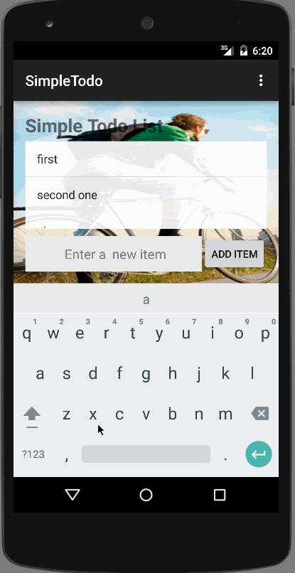

# [Android Bootcamp]: 00  Simple Todo List

This is a [simple todo list](https://docs.google.com/presentation/d/15JnmfmFa0hJOEkBhG_TeymChLzDzpOTJvBlOj29A9fY/edit#slide=id.gf45d6347_3_0) app.
In this app, the user can view the list, add the item and remove the item of the todo list.
The data of the list will be saved on the device.

Completed user stories:

 * [x] Required: User can view a list todo items
 * [x] Required: User can add a item into the list
 * [x] Required: User can remove a item from the list
 * [x] Required: User can edit a item from the list
 * [x] Required: The list data will be saved on device
  
Extention:
 * use SQLite
 * use DialogFragment for editing mode
 * add aditional style

 
